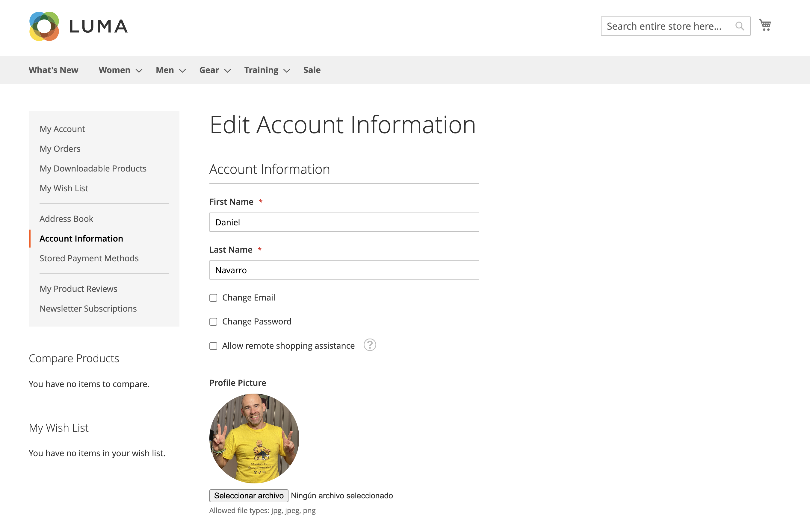
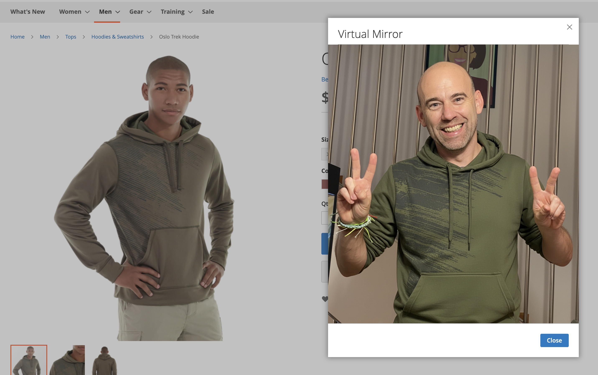
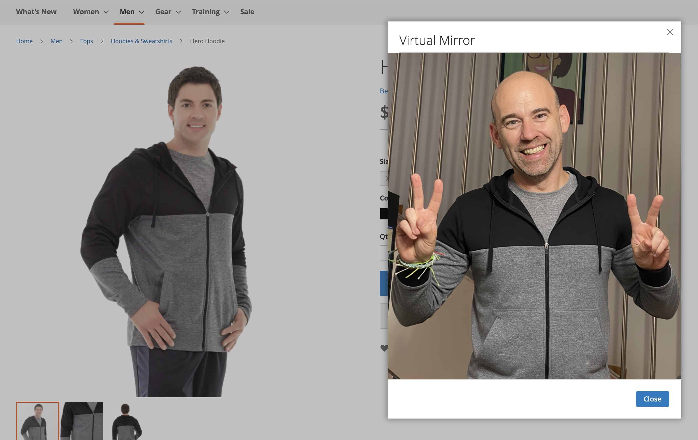

# ByDN Virtual Try On free Extension for Magento powered by Nano Banana

Because your customers don’t just want to see themselves in the fitting room… they also want to see themselves on the screen.

## 🤔 What is this?

A module for Magento 2.4+ that adds a magic button to the product page and lets the user “try on” the item in their own photo.
No hype: it’s not the Matrix, but it’s a cool extra to improve your online store experience.

## 🚀 Installation

```bash
composer require bydn/virtualmirror
bin/magento module:enable Bydn_VirtualMirror
bin/magento setup:upgrade
bin/magento cache:flush
```

If you’re one of those who drag folders into app/code and then ask in forums why it doesn’t work… it also works, but I don’t recommend it 😅.

## ⚙️ Configuration

Backend: don’t worry, there are barely any settings.

The button appears on the product page with a popup modal.

In the PHP (Api.php) you’ll find where the image magic happens.

## 🧪 Usage

1. In your user account, upload your photo under Account Information.



2. Go to a product page.
3. Click on “Try on me.”
4. Enjoy




## 🛠️ Requirements

Magento 2.4.8+ (tested). Probably works also in previews versions, but I didn't test it.

PHP 8.3 / 8.4 (probably 8.2 and 8.1 as well, but not tested)

## 📜 License

GNU GENERAL PUBLIC LICENSE → you can use it, modify it, and share it.
That said, if you build a million-dollar SaaS with this, don’t forget to buy me a beer 🍺.

## 👨‍💻 Author

Made with care by Dani Navarro
More modules on the way → all realistic.
